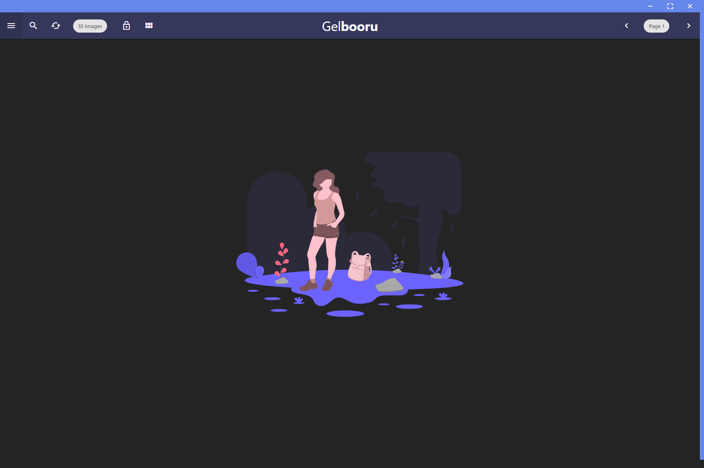
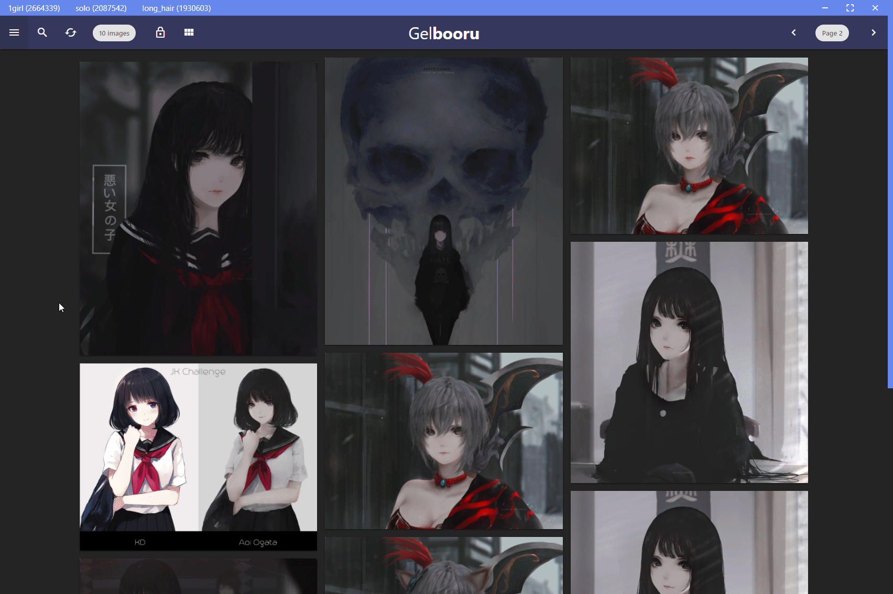

<p align="center">
  <a href="build/icon-black.png">
    
    
  </a>

  <h3 align="center">Gelbooru Client</h3>

  <p align="center">
    An Electron app for Gelbooru.
    <br>
    <br>
    <a href='https://semaphoreci.com/keziahmoselle/gelbooru-client'> </a>
    <br>
    <a href='https://github.com/standard/standard'> </a>
</p>





## Features

* [x] Search images (10 to 100 per request)
* [x] Browse all, see Top images and Hot images
* [x] Rating (Safe, Explicit, Questionable)
* [x] Blacklist (Exclude tags)
* [x] 3 cards layout
* [x] Advanced Theme Customization
* [x] Download image
* [x] Endless scrolling (Thank's to [@Shiroifuyu](https://github.com/Shiroifuyu))
* [x] Auto Update

## Features incoming

* [ ] Gallery mode
* [ ] Download all visible images (up to 100)
* [ ] Code Signing
* [ ] Build for MacOS and Linux

## Download
> Note: gelbooru-client is developped on Windows, but you can follow the `Installing` part to build it on your platform, it should work. If not please [create an issue](https://github.com/KeziahMoselle/gelbooru-client/issues/new).

Head to [Release](https://github.com/KeziahMoselle/gelbooru-client/releases) tab, and download the version you want.

## Installing

```sh
> git clone https://github.com/KeziahMoselle/gelbooru-client.git
```
Install dependencies :
```sh
> cd gelbooru-client && npm install
```
To run the app (with hot reload):
```sh
> npm start
```

Your code must follow the [standardjs](https://standardjs.com/) rules :
```sh
> npm test
```

## Build

```sh
> npm run dist
```
The binaries will be created in the `dist` folder.

## Built With

* [Electron](https://electronjs.org/) - framework for creating native applications with web technologies
* [Axios](https://github.com/axios/axios) - Promise based HTTP client for the browser and node.js
* [MaterializeCSS](http://next.materializecss.com/) - A modern responsive front-end framework based on Material Design
* [Gelbooru API](https://gelbooru.com/index.php?page=help&topic=dapi) - An image board based on Danbooru
* [Undraw Illustrations](https://undraw.co/illustrations) - Illustrations under [MIT License](https://undraw.co/license)


## License

gelbooru-client is licensed under the [MIT License](LICENSE).
